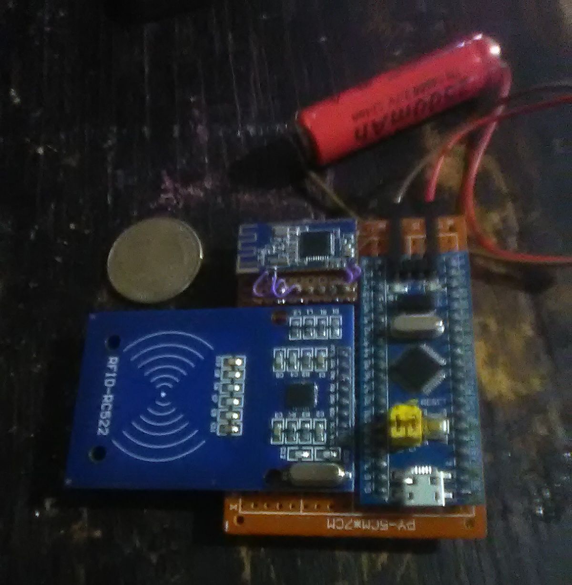
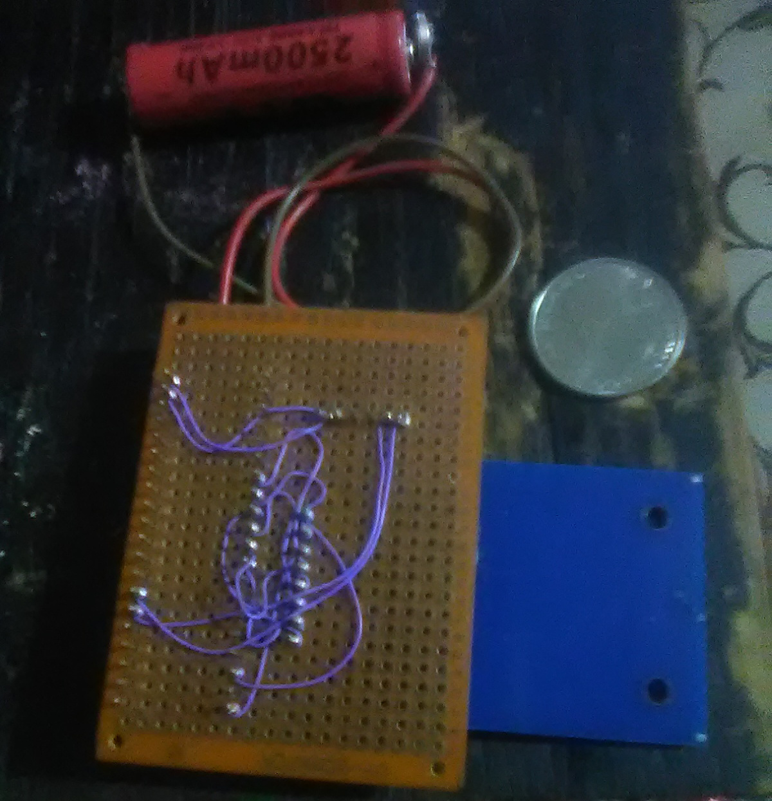

GUARDBOT
------
This is guardbot my alarm program. It is for linux only. It is not very well finished and I do not plan to provide documentation. I am simply uploading it to help others and to provide an example of my own skill and ingenuity. I started with a webcam for motion detection. If motion is detected it will run the warning script that I use to play a sound. Further motion detection will trigger the alarm script that will email the images to whatever address you put in the isplogin file. It would be trivial to defeat this system if an attacker had forknowledge.

The source code may not work without modification to suit your specific application.You will probably have to tinker. I included the gattlib library I used for btle. You will have to build that yourself before compiling the main program. It also has problems with battery life on the btle rfid reader.

I feel that personal home alarm systems are a market that may have potential for growth. Specifically the low end cheap systems.

RFID
------
This is the way I like to prototype.
Wire Wrap.

The firmware is a simple arduino sketch for the stm32f103.It uses an hm10 btle module and an rcc522 rfid module.

